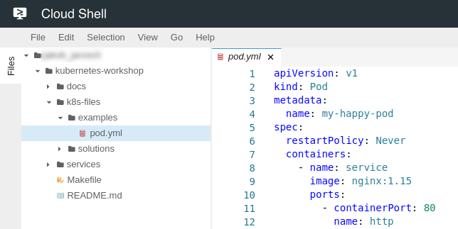

# Setup your Account

Before we can begin with launching our first Kubernetes workloads we need to setup our development environment.

## Open your Google Cloud project

The project in Google Cloud contains all the resources you will create during the workshop. This includes the Kubernetes cluster, load balancers, etc.

1. Open the [Cloud Console](https://console.cloud.google.com)
2. Login with your Google account used for registration
3. Find your personal project for the workshop (`k8sworkshop-stuttgart2019-[0-9]+`)
4. Enter your project id below, this will customize the tutorial<br>
   <input id="gcloud-project-id" placeholder="k8sworkshop-stuttgart2019-22" style="width:300px"> <button id="gcloud-project-id-apply">Apply</button>

## Start Cloud Shell

The Cloud Shell is a browser based IDE and command line that can be used to execute shell commands inside your project.
The shell has all tools required to launch Kubernetes workloads pre-installed.

1. Open the [Cloud Shell](https://console.cloud.google.com/cloudshell/editor?project=$GCLOUD_PROJECT_ID) in a new Tab
2. Run `gcloud config get-value project`, this should return `$GCLOUD_PROJECT_ID`.

## Clone the workshop repository

We have a repository that contains examples and solutions that will help to solve the tasks of the workshop.

1. Clone our workshop repository:
   ```bash
   git clone https://github.com/itdesign/kubernetes-workshop.git
   ```
2. You should see the repository with its directories in the upper screen:
   
3. The directory `kubernetes-workshop/k8s-files` contains everything we need for the workshop.
