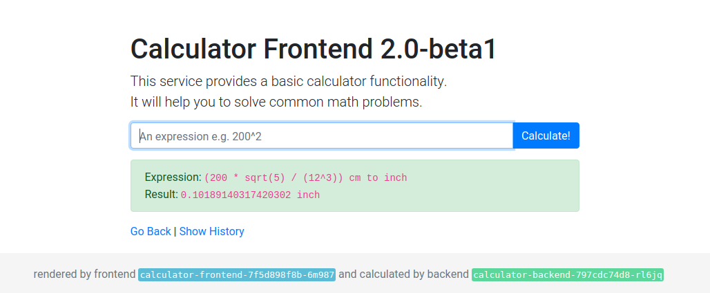
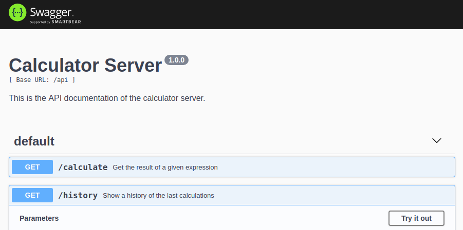

<!-- prettier-ignore -->
<h1>Architecture Overview</h1>
{: .no_toc }

During the workshop we will use a calculator app to get familiar with Kubernetes.

<!-- prettier-ignore -->
1. toc
{:toc}

## Overall architecture

The app basically consists of three services, the backend, a frontend and the database.

- The user accesses the frontend to let the application evaluate an expression.
- The frontend uses the backend to calculate the result of the calculation.
- The backend uses the database to store a history of calculations.
- The backend and frontend can be scaled up and down to handle increased load.

## Frontend service

The frontend is a UI to enter calculations and view the result. It is also possible
to view a history all calculations.

- The service is implemented in [Node.js](https://nodejs.org/) and [Typescript](https://www.typescriptlang.org/).
- It uses [React](https://reactjs.org/) with [server-side rendering](https://reactjs.org/docs/react-dom-server.html) to generate the HTML page.
- It communicates with the backend using REST and JSON.
- It is already packaged with Docker and published in a registry.

### Images

These images can be used to run a calculator frontend on Kubernetes.

| Image                                                | Description                              |
| ---------------------------------------------------- | ---------------------------------------- |
| `quay.io/kubernetes-workshop/calculator-frontend:v1` | Version 1 with calculation functionality |
| `quay.io/kubernetes-workshop/calculator-frontend:v2` | Version 2 with a UI to show the history  |

## Backend service

The backend is service that returns the result for a mathematical expression. It stores
a history of expressions and their results.

- The service is implemented in [Node.js](https://nodejs.org/) and [Typescript](https://www.typescriptlang.org/).
- It uses [Express](https://expressjs.com/) to provide a REST API.
- The expressions are parsed and calculated using [Math.js](https://mathjs.org/).
- It provides a graphical UI to test the REST API using [Swagger](https://swagger.io/), it is served under `/`.
- It provides an endpoint `GET /calculate` to calculate the result of a given expression.
- It provides an endpoint `GET /history` to get a list of previous calculations.
- It uses a database to store a history of previous calculations.
  - By default it is stored in a internal [SQLite](https://www.sqlite.org/) database.
  - It is possible to store the history in a external [PostgreSQL](https://www.postgresql.org/) database.

### Known bugs

The service has a known bug. It will crash when an expression can't be parsed.
This must be taken into account when running the service. During the tutorial we will implement
mechanisms to automatically recover from crashes of the service.

### Images

These images can be used to run a calculator backend on Kubernetes.

| Image                                               | Description                   |
| --------------------------------------------------- | ----------------------------- |
| `quay.io/kubernetes-workshop/calculator-backend:v1` | The backend with all features |

### Configuration options

The backend service can be configured to store the calculation history in a PostgreSQL database.
Therefore it must be configured where the service can find the database.

| Environment variable name | Default      | Description                                               |
| ------------------------- | ------------ | --------------------------------------------------------- |
| `PG_HOST`                 | `-`          | The hostname where the PostgreSQL server can be found     |
| `PG_PORT`                 | `5432`       | The port where the PostgreSQL server listens              |
| `PG_USER`                 | `postgres`   | The user used for authentication against the database     |
| `PG_PASS`                 | `postgres`   | The password used for authentication against the database |
| `PG_DB`                   | `calculator` | The database name used to store the history               |

**A PostgreSQL connection is only used when the `PG_HOST` variable is configured. Otherwise SQLite is used.**
